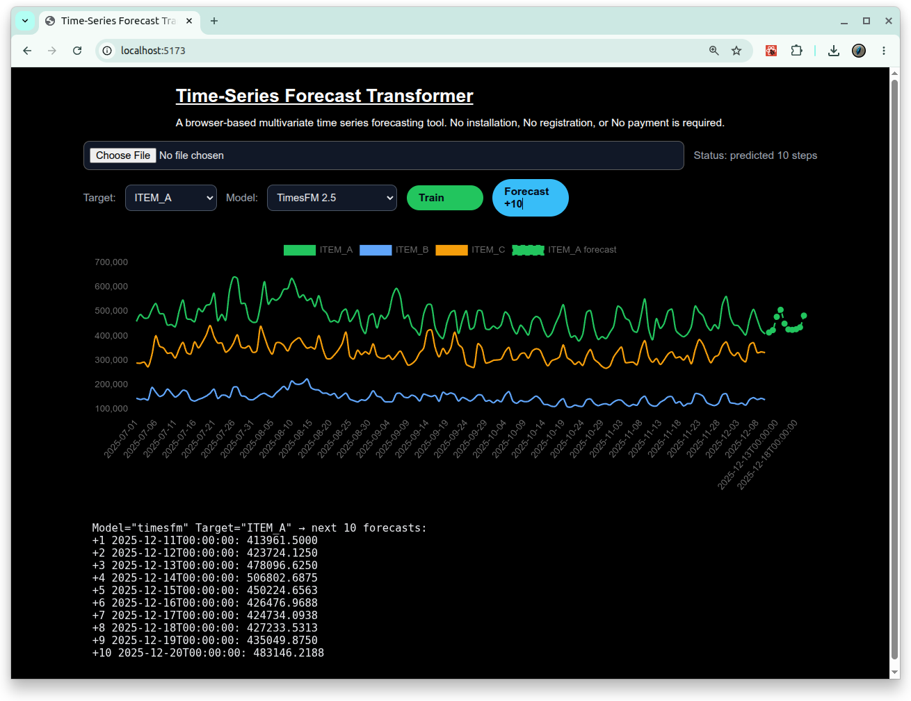

# [Time-Series-Forecast-Transformer](https://github.com/europanite/time-series-forecast-transformer "Time-Series-Forecast-Transformer")

[](https://opensource.org/licenses/Apache-2.0)
[](https://www.python.org/)


[](https://github.com/europanite/time-series-forecast-transformer/actions/workflows/ci.yml)
[](https://github.com/europanite/time-series-forecast-transformer/actions/workflows/codeql.yml)
[](https://github.com/europanite/time-series-forecast-transformer/actions/workflows/pages/pages-build-deployment)
[](https://github.com/europanite/time-series-forecast-transformer/actions/workflows/lint.yml)




Time-Series-Forecast-Transformer working at the local container.

## Run

```bash
docker compose build
docker compose up
```

Open the frontend at <http://127.0.0.1:5173>. 

The API is also available at <http://127.0.0.1:8000>.


## Backend CLI

Run an offline smoke forecast with the top-level sample dataset:

```bash
docker compose run --rm backend \
  python -m local_ts_forecast.cli forecast \
    --backend seasonal_naive \
    --input data/sample_data.csv \
    --target ITEM_A \
    --output outputs/forecast.csv \
    --plot outputs/forecast.png
```

Run the API example:

```bash
docker compose up -d backend
docker compose exec backend python scripts/api_example.py
```

## GPU

```bash
docker compose -f docker-compose.yml -f docker-compose.gpu.yml up --build backend
```

## Test

```bash
docker compose -f docker-compose.test.yml up --build --abort-on-container-exit
```

## Train

```bash
# M4 dataset

# Create long fomart data
docker compose run --rm backend \
  python -m local_ts_forecast.cli convert-dataset \
    --dataset m4 \
    --m4-train-dir data/m4/Train \
    --m4-frequency Monthly \
    --max-series 10000 \
    --output outputs/m4_monthly_train_long.csv

# Create Holdouts
docker compose run --rm backend \
  python scripts/create_holdouts.py


# Chronos-2 zero-shot
docker compose -f docker-compose.yml -f docker-compose.gpu.yml run --rm backend \
  python -m local_ts_forecast.cli forecast \
    --backend chronos2 \
    --input outputs/m4_monthly_train_long.csv \
    --target target \
    --prediction-length 18 \
    --context-length 36 \
    --batch-size 64 \
    --device cuda \
    --output outputs/m4_monthly_zero_shot_chronos2.csv \
    --plot ""

# Chronos-2 adapter/head
docker compose -f docker-compose.yml -f docker-compose.gpu.yml run --rm backend \
  python -m local_ts_forecast.cli train-adapter \
    --dataset m4 \
    --m4-train-dir data/m4/Train \
    --m4-frequency Monthly \
    --base-backend chronos2 \
    --model-id autogluon/chronos-2-small \
    --context-length 36 \
    --prediction-length 18 \
    --max-series 10000 \
    --max-windows 20000 \
    --windows-per-series 2 \
    --base-batch-size 64 \
    --steps 5000 \
    --batch-size 256 \
    --learning-rate 0.001 \
    --hidden-size 128 \
    --device cuda \
    --output outputs/m4_monthly_chronos2_adapter.pt

# adapter
docker compose -f docker-compose.yml -f docker-compose.gpu.yml run --rm backend \
  python -m local_ts_forecast.cli forecast \
    --backend foundation_adapter \
    --checkpoint outputs/m4_monthly_chronos2_adapter.pt \
    --input outputs/m4_monthly_train_long.csv \
    --target target \
    --prediction-length 18 \
    --device cuda \
    --output outputs/m4_monthly_chronos2_adapter_forecast.csv \
    --plot ""

# Compare zero-shot vs adapter
docker compose run --rm backend \
  python scripts/compare_forecast_metrics.py \
    outputs/m4_monthly_zero_shot_chronos2.csv \
    outputs/m4_monthly_chronos2_adapter_forecast.csv

# TimesFM
# zero-shot TimesFM：
docker compose -f docker-compose.yml -f docker-compose.gpu.yml run --rm backend \
  python -m local_ts_forecast.cli forecast \
    --backend timesfm \
    --input outputs/m4_monthly_train_long.csv \
    --target target \
    --prediction-length 18 \
    --context-length 36 \
    --device cuda \
    --output outputs/m4_monthly_zero_shot_timesfm.csv \
    --plot ""

# TimesFM frozen + adapter：
docker compose -f docker-compose.yml -f docker-compose.gpu.yml run --rm backend \
  python -m local_ts_forecast.cli train-adapter \
    --dataset m4 \
    --m4-train-dir data/m4/Train \
    --m4-frequency Monthly \
    --base-backend timesfm \
    --model-id google/timesfm-2.5-200m-pytorch \
    --context-length 36 \
    --prediction-length 18 \
    --max-series 5000 \
    --max-windows 10000 \
    --windows-per-series 2 \
    --base-batch-size 32 \
    --steps 3000 \
    --batch-size 256 \
    --learning-rate 0.001 \
    --hidden-size 128 \
    --device cuda \
    --output outputs/m4_monthly_timesfm_adapter.pt

# TimesFM adapter：
docker compose -f docker-compose.yml -f docker-compose.gpu.yml run --rm backend \
  python -m local_ts_forecast.cli forecast \
    --backend foundation_adapter \
    --checkpoint outputs/m4_monthly_timesfm_adapter.pt \
    --input outputs/m4_monthly_train_long.csv \
    --target target \
    --prediction-length 18 \
    --device cuda \
    --output outputs/m4_monthly_timesfm_adapter_forecast.csv \
    --plot ""

# TimesFM Compare：
docker compose run --rm backend \
  python scripts/compare_forecast_metrics.py \
    outputs/m4_monthly_zero_shot_timesfm.csv \
    outputs/m4_monthly_timesfm_adapter_forecast.csv


# Chronos-2 zero-shot、Chronos-2 adapter、TimesFM zero-shot、TimesFM adapter
docker compose run --rm backend \
  python scripts/compare_forecast_metrics.py \
    outputs/m4_monthly_zero_shot_chronos2.csv \
    outputs/m4_monthly_chronos2_adapter_forecast.csv \
    outputs/m4_monthly_zero_shot_timesfm.csv \
    outputs/m4_monthly_timesfm_adapter_forecast.csv
```

## M4 Monthly benchmark results

Evaluation target: **M4 Monthly**  
Forecast horizon: **18**  
Evaluation rows: **180,000**

| Model | Forecast type | Output path | MAE | RMSE | MAPE | sMAPE |
|---|---|---|---:|---:|---:|---:|
| Chronos-2 | Zero-shot | `outputs/m4_monthly_zero_shot_chronos2.csv` | **598.023868** | 1374.962430 | **16.871542%** | **14.438171%** |
| Chronos-2 + Adapter | Frozen foundation model + trained adapter/head | `outputs/m4_monthly_chronos2_adapter_forecast.csv` | 646.648479 | 1422.491100 | 17.943740% | 14.863127% |
| TimesFM | Zero-shot | `outputs/m4_monthly_zero_shot_timesfm.csv` | 607.634425 | **1367.991547** | 17.942648% | 14.922394% |
| TimesFM + Adapter | Frozen foundation model + trained adapter/head | `outputs/m4_monthly_timesfm_adapter_forecast.csv` | 765.064199 | 1540.075852 | 23.020814% | 17.705266% |